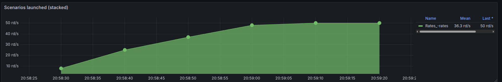
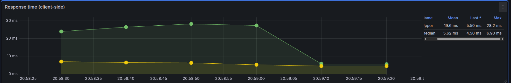

# Analisis de la arquitectura base 

A continuación se presenta un análisis detallado de cada endpoint, evaluando su comportamiento bajo condiciones de baja y alta carga. Para cada uno se consideran las siguientes métricas:

- Cantidad de solicitudes por segundo (RPS)
- Estado de las solicitudes (códigos de respuesta)
- Tiempo de respuesta promedio
- Recursos consumidos (CPU y memoria)

Este enfoque permite identificar posibles cuellos de botella y oportunidades de optimización en la arquitectura base.

## Rates 

### Prueba con carga baja 

Se realiza una prueba de carga con los siguientes parametros usando la herramienta artillery

```yaml
  phases:
    - name: Ramp
      duration: 30
      arrivalRate: 1
      rampTo: 5
    - name: Plain
      duration: 60
      arrivalRate: 5
```

#### Resultados observados 



Para el escenario con una carga baja se observa el crecimiento sostenido y un posterior estado en el cual se mantiene constante la cantidad de request realizadas al servidor. Se observa que el maximo de la canitidad reportada de request son unas 50 y una media de 36.3 request por segundo


Tambien se logra observar que en un escerario con carga baja, el servidor consigue responder satisfactoriamente a todas las consultas realizas sin presentar fallos



Del lado del cliente se aprecian dos medidas en el tiempo de respuesta, el maximo registrado y la media del tiempo de respuesta. En la totalidad de la prueba de carga se la media se mantiene en un rango de 4-6 ms sin variar de manera bruzca, a su vez, el maximo del timepo de respuesta tiene una media 19.6 ms y se reduce drasticamente en el momento en el que el servidor alcanza su maxima cantidad de carga, mismo punto en el que alcanza un maximo, el cual corresponde a 28.2 ms 


Finalmente en un escenario de carga baja, el sistema se encuentra usando recursos casi constantes, las variaciones en el uso del CPU se encuentra en un rango de 0.5% a 0.6% y la memoria a su vez usa un porcentaje aun menor encontrandose en un rango de 0.071% a 0.074% 

<!-- En conclusion analizando los graficos y leyendo el resumen dado del comportamiento de la api, se realizaron 390 consultas al endpoint `rates` de las cuales todas fueron contestadas de manera satisfactoria. -->


### Prueba con mayor carga 
A continuación se realiza una prueba de estrés más intensa sobre la API, específicamente en el endpoint `rates`, con el objetivo de analizar el comportamiento del sistema bajo condiciones de alta demanda y cómo esto impacta en los atributos de calidad, tales como disponibilidad, rendimiento y uso de recursos.

Se incrementa significativamente la cantidad de solicitudes por segundo, simulando un escenario donde múltiples usuarios acceden simultáneamente al servicio. Los resultados permiten identificar el punto de saturación del sistema, posibles errores en las respuestas y variaciones en los tiempos de respuesta y consumo de recursos.

Para esto se recurre nuevamente a la herramienta artillery, esta vez modificando la condiguracion anterior por la siguiente: 

```yaml
  phases:
    - name: Ramp
      duration: 30
      arrivalRate: 0
      rampTo: 1000
    - name: Plain
      duration: 60
      arrivalRate: 600
```

#### Resultados observados 


En un escenario de mayor carga se observa un crecimiento sostenido en la cantidad de request por segundos, una reduccion y estabilizacion de la misma, en esta ocasion el grafico no permite realizar conclusiones sobre el estado de la aplicacion


En cambio, en el grafico del estado de las respuestas se observa un crecimiento en la cantidad de respuestas correctas del servidor, pero durante la etapa de llegada constante de la cantidad de request por segundo se observa la aparicion de casos de error en las respuestas a los clientes, indicando claramente que el servidor alcanza un limite en la cantidad de clientes que puede atender


Para el tiempo de respuestas se observa que una vez el servidor empieza a responder con codigos de error para los clientes, inicia un crecimiento acelerado en los maximos de tiempo de respuesta registrados, para el maximo, la media alcanza 1.46s y el maximo ahora alcanza casi los 10s para poder completar una consulta, mientras que para la media, se observa un crecimiento parecido. Esto indica claramente que el servidor presenta saturacion de clientes y no permite responder adecuadamente a todos los clientes que intentan realizar una consulta sobre este endpoint 


A su vez, los resultados observados para los recursos utilizados, en primer lugar para la memoria, se observa un aumento en comparacion al test anterior pero no representa un uso excesivo de la misma, haciendo uso de la memoria ram en un rango de 0.188% a 0.194%. Por el contrario esta vez el CPU alcanza el maximo de su uso rapidamente, llegando a usar un 35.7%, esto antes de alcanzar el maximo en la cantidad de request realizados al servidor, sin embargo a partir de haber alcanzado el limite el uso del cpu desciende rapidamente y a pesar de anteriormente haber observado respuestas con errores en los clientes y no se observaria una relacion con el uso de recursos excesivos, es decir, la aplicacion no alcanza un limite en el uso de los recursos disponibles 

#### Conclusion

En conclusion en un escenario de carga alta el servidor no es capaz de atender a todos los clientes de manera eficiente y afectando completamente la disponibilidad del servicio, el cual es un atributo de calidad clave y uno de los que se desea mejorar para incrementar la percepcion positiva de la aplicacion por parte de los clientes 